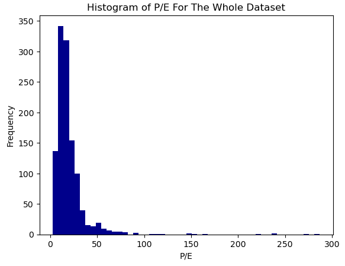

# Project Title: Predicting Price-Earnings Ratios In Public Equities

## Non-Technical Explanation Of The Project
The aim of this project is to build models that can predict company valuations for public equities using fundamental financial data. For this project the output valuation metric will be price to earnings (P/E). The P/E ratio is the current share price of a stock divided by the expected net profit per share over the next twelve months. The fundamental financial data I use includes: expected revenue growth, profit growth, return on capital, margins and indebtedness.

This project could have two useful applications: (i) Screening for companies that are unusually “cheap” or “expensive” given their underlying fundamentals; (ii) Generating more rigorous “exit multiples” to help analysts build discounted cash flow models. An "exit multiple" is the valuation that an analyst uses to get a terminal value in a discounted cash flow model.

## Data
The data that I am using in this project is publicly available data on company financials, share prices and analyst expectations. I sourced this data from Koyfin (www.koyfin.com). Koyfin is an online tool that gives access to fundamental stock market data and aggregates it from other sources. One major drawback of this data is that it only gives a single year for historic data (for example, I can get return on capital only for the previous reported year, not for an average over previous years). This is an issue that I will return to in the conclusion.

In this project I have specifically focused on: (i) Consumer staples and consumer discretionary companies globally; (ii) With a market capitalisation of greater than USD 500mn. I start with 1,183 datapoints.

The charts below show some of my initial exploratory analysis of the data. The first chart is a histogram of P/E ratios across the dataset. The data is heavily skewed and I decided to trim the data and remove the small number of outliers with a P/E of more than 100.

The second chart shows a heatmap of average P/E ratios by country and industry (white spaces are where no observations are available). The obvious feature here is that valuations in India appear significantly higher than other countries. Due to this observation I decided to include a dummy variable for India in my model.

The third chart shows a correlation matrix among the feature variables. It is unsurprising that there is a correlation within the different growth metrics and within the different margin metrics. In order to simplify the model I remove several of these variables including: (i) historic growth and; (ii) net income margin and free cash flow margin. The rationale for this is that I retain future growth estimates (making historic growth less relevant) and that net income and free cash flow margin can be quite volatile for a single year and may have as much noise as signal.

## Model 
In this project I trained three separate models and compared them. I trained: (i) A simple linear regression; (ii) A random forest model and; (iii) A neural network with two hidden layers.

A linear regression is useful for a first, quick, analysis of the data. However, by its nature it is not able to account for any potential non-linear relationships between the input variables and output variable.

A random forest model is appropriate for this type of financial data because it is accurate (through aggregating individual decision trees) and robust to noise. One downside of the model is computational complexity but given the relatively small dataset I use this is not a major constraint.

I trained a neural network to explore whether it was able to capture interesting non-linear relationships in the data. However, this model did not work particularly well.

## Hyperparameter Optimisation
Given that my dataset is fairly small and the model is simple I was able to take a grid search approach to hyperparameter optimisation.

For the random forest model I did a hyperparameter optimisation over the number of estimators (number of decision trees used) and the maximum depth of each decision tree. I was able to do this with a simple "for" loop where I trained each model on training data and then took the one that performed best on the validation dataset.

For the neural network I decided to use a neural network with two hidden layers. Then I looked to optimise across five hyperparameters: (i) Activation function - ReLU or Leaky ReLU; (ii) Number of neurons per hidden layer - 5, 6 or 7; (iii) Number of epochs - 5, 10, 20, 30; (iv) Batch size - 16, 32, 64 and; (v) Learning rate - 0.001, 0.002, 0.003. I was also able to do this with a simple "for" loop where I trained each model on training data and then took the one that performed best on the validation dataset.

## Results
After finding the best version of each model above I ran a final test of that model on the test dataset. I rescaled the results (the data had previously been normalised) and then calculated the root mean square error for each model on the test dataset.

The results are not particularly impressive and some barely perform better than a naïve model which uses the average P/E in the test data as a predictor. Note that the average P/E in the dataset is 19. This means that the RMSE of 10 in the random forest model leaves a significant amount of unexplained variation in the data.

In the chart below I plot the actual P/E and predicted P/E across the entire dataset for the random forest model (trained on the training dataset). You can see that there is a lot of variation in the data and the model starts to break down for P/E ratios of much above 40x. One interpretation of this is that once stocks start to get highly expensive, near-term fundamentals alone can't account for the valuation.

I'll conclude with a few reflections on this project, the challenges I faced and next steps for further work.

1. There was a limitation in the dataset I used because I could only easily get one previous year of financial data. I think this increased the noisiness of the dataset. If I had access to better data I would use longer term averages for some metrics (for example average return on capital over the previous three years). In addition, it might be helpful to include the historic volatility of variables such as return on capital and margins for each company. Greater volatility (everything else the same) might push down on valuations.
2. If I did further work I would experiment with decreasing the P/E value at which I treated an observation as an outlier (in this project I used 100 as that point). The chart above shows that the model struggles to predict high P/E stocks.
3. If I could conduct this project again I would want to expand my dataset using the variables I mentioned above. I would also look to include some sentiment metrics, for example by collecting data on sentiment analysis of recent earnings calls.
